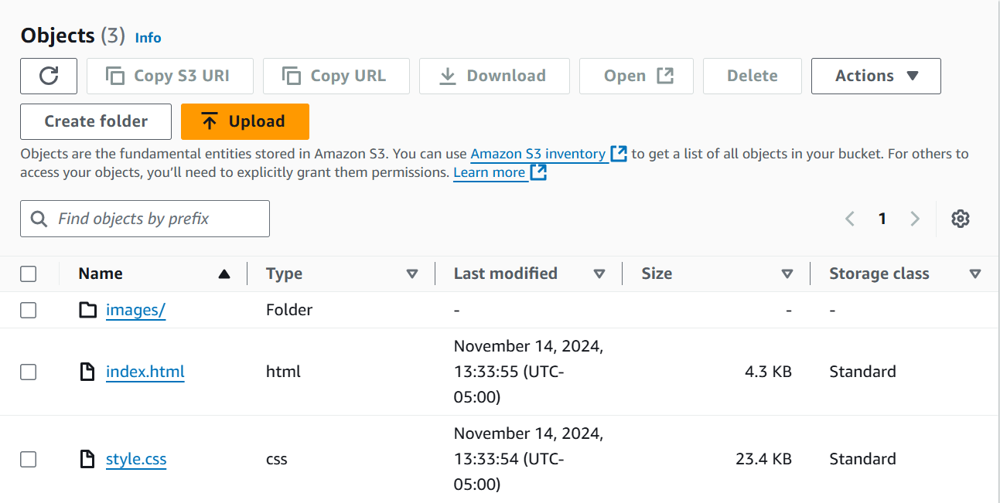
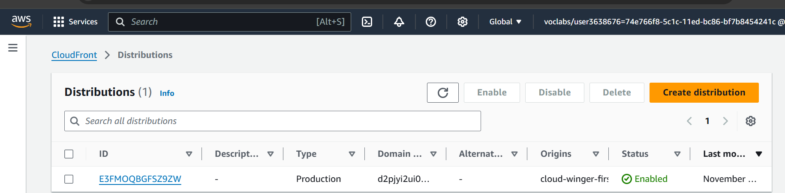
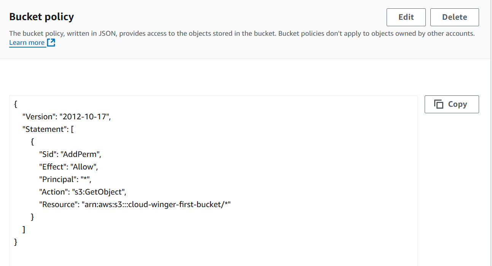
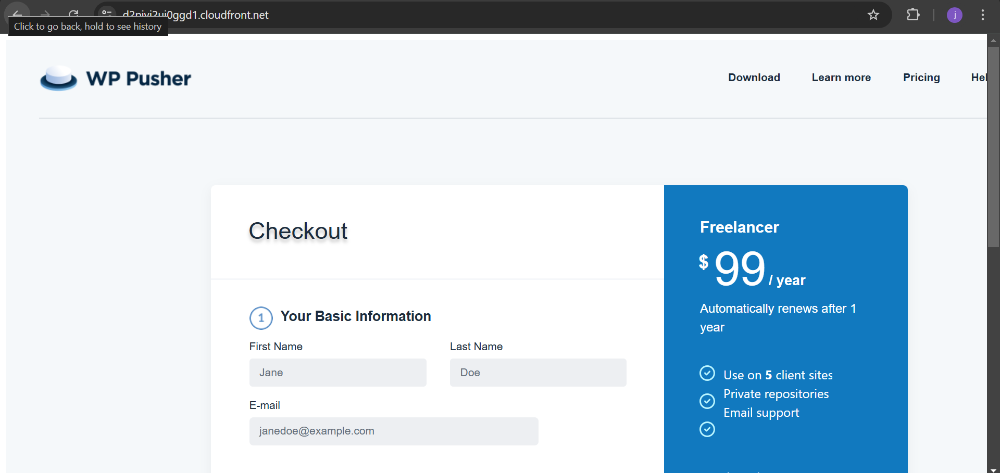

# Hosting a Static Website on AWS S3 with CloudFront as a CDN

- step 1: create an s3 bucket 

- step 2: configure the bucket to allow public access

- step 3: upload files and folder

- step 4: go to cloudfront, create a distribution and configure the settings;
- add origin domain
- change origin access to origin access control
- create new OAC
- enable security protection
- enter index.html into default root object
- create distribution

-step 5: copy policy, go back to the bucket created, in permissions edit the bucket policy

- step 6: go back to cloudfront and copy the domain URL and check it on the browser to confirm access to your website

- step 7: accessing via S3 object URL

